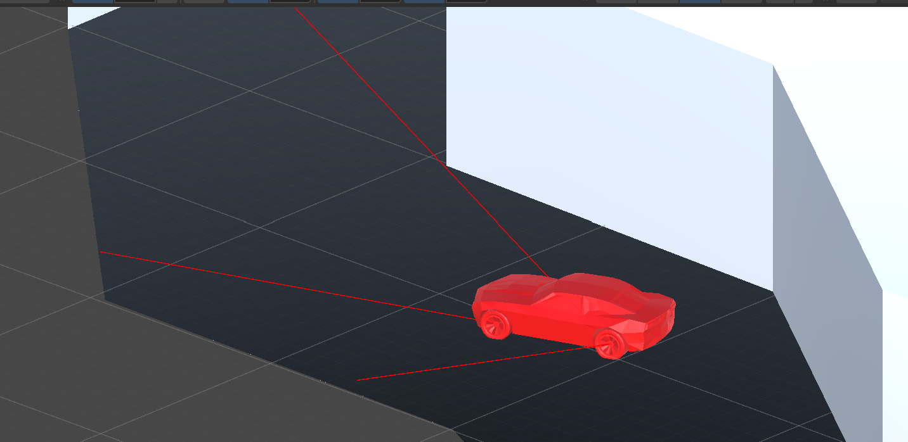
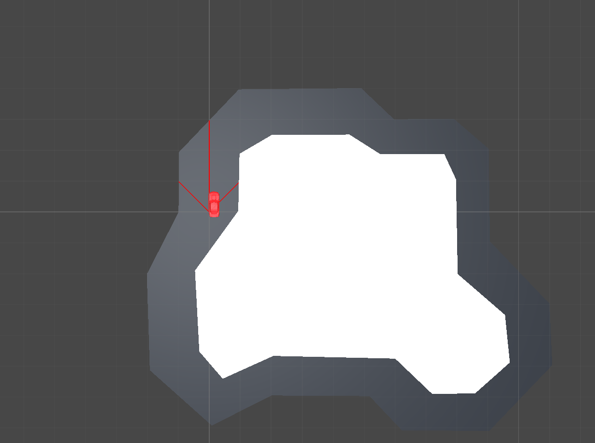

# Genetic Algorithm Self-Driving Car

A Unity self-driving car simulation that trains an artificial neural network with a genetic algorithm. Cars use raycast sensors to read the track, feed those values into a neural network, and evolve better driving behavior over generations.

## Preview

## Project Overview

This project is built around three main scripts:

- `CarController.cs` controls the car, reads sensors, moves the car, calculates fitness, and reports when the car dies.
- `NeuralNetwork.cs` stores and runs the artificial neural network that decides acceleration and steering.
- `GeneticManager.cs` manages the population, generations, selection, crossover, mutation, and training speed.

## Requirements

- Unity 6.4 or newer
- MathNet Numerics for matrix operations

## How It Works

1. `GeneticManager` creates an initial population of neural networks.
2. The current network is assigned to `CarController`.
3. The car casts three sensor rays: right-forward, forward, and left-forward.
4. Sensor distances are passed into `NeuralNetwork.RunNetwork`.
5. The network outputs acceleration and steering.
6. The car drives until it crashes, performs poorly for too long, or reaches the fitness goal.
7. The final fitness score is saved to the active network.
8. After the full population is tested, the best networks are selected, crossed over, mutated, and used for the next generation.

## CarController Properties

### Driving Output

| Property | Description |
| --- | --- |
| `accelerationInput` | Current acceleration output from the neural network. |
| `steeringInput` | Current steering output from the neural network. |
| `timeSinceStart` | How long the current genome has been driving. |

### Fitness

| Property | Description |
| --- | --- |
| `overallFitness` | Total score used to rank the current network. |
| `distanceMultipler` | Controls how much distance traveled affects fitness. |
| `avgSpeedMultiplier` | Controls how much average speed affects fitness. |
| `sensorMultiplier` | Controls how much wall distance/sensor safety affects fitness. |

### Network Options

| Property | Description |
| --- | --- |
| `layers` | Number of hidden layer groups in each neural network. |
| `neurons` | Number of neurons in each hidden layer. More neurons can learn more complex behavior but may train slower. |

### Runtime Values

| Variable | Description |
| --- | --- |
| `network` | Active neural network controlling the car. |
| `startPosition` | Position used when resetting the car. |
| `startRotation` | Rotation used when resetting the car. |
| `lastPosition` | Previous physics-step position used for distance tracking. |
| `totalDistanceTravelled` | Total distance driven by the current genome. |
| `avgSpeed` | Average speed of the current genome. |
| `aSensor` | Right-forward raycast sensor distance. |
| `bSensor` | Forward raycast sensor distance. |
| `carSensor` | Left-forward raycast sensor distance. |
| `interpolate` | Smoothed movement vector used by `MoveCar`. |

## GeneticManager Properties

### References

| Property | Description |
| --- | --- |
| `controller` | Reference to the car controller that receives each neural network. |

### Controls

| Property | Description |
| --- | --- |
| `initialPopulation` | Number of neural networks tested per generation. |
| `mutationRate` | Chance that selected network weights mutate. Higher values create more randomness. |
| `timeScale` | Speeds up training by changing Unity time. Current range is `1x` to `20x`. |

### Crossover Controls

| Property | Description |
| --- | --- |
| `bestAgents` | Number of top networks copied into the next generation. |
| `worstAgents` | Number of low-performing networks still allowed into the gene pool for variety. |
| `numberToCrossover` | Number of child networks created through crossover. |

### Public View

| Property | Description |
| --- | --- |
| `currentGeneration` | Current generation number. |
| `currentGenome` | Index of the network currently being tested. |

### Runtime Values

| Variable | Description |
| --- | --- |
| `genePool` | Weighted list used to choose crossover parents. Better networks are added more often. |
| `defaultFixedDeltaTime` | Stores Unity's original fixed timestep so it can be restored later. |
| `naturallySelected` | Number of networks already placed into the next population. |
| `population` | Array of all networks in the current generation. |

## NeuralNetwork Properties

| Property | Description |
| --- | --- |
| `inputLayer` | Matrix containing the three car sensor inputs. |
| `hiddenLayers` | Hidden layer matrices used during network calculation. |
| `outputLayer` | Matrix containing acceleration and steering outputs. |
| `weights` | Weight matrices connecting each network layer. |
| `biases` | Bias values added during layer calculations. |
| `fitness` | Score assigned after the car finishes driving. |

## Key Methods

| Script | Method | Purpose |
| --- | --- | --- |
| `CarController` | `ResetNetwork` | Assigns a network to the car and resets it. |
| `CarController` | `InputSensors` | Casts ray sensors and stores normalized distances. |
| `CarController` | `MoveCar` | Moves and turns the car from network output. |
| `CarController` | `CalculateFitness` | Scores the car from distance, speed, and sensor readings. |
| `GeneticManager` | `CreatePopulation` | Creates the first generation. |
| `GeneticManager` | `Repopulate` | Builds the next generation after all genomes are tested. |
| `GeneticManager` | `Crossover` | Creates child networks from parent networks. |
| `GeneticManager` | `Mutate` | Randomly changes network weights. |
| `NeuralNetwork` | `Initialize` | Builds layers, weights, and biases. |
| `NeuralNetwork` | `RunNetwork` | Processes sensor inputs and returns acceleration/steering. |

## Tuning Tips

- Raise `initialPopulation` for more genetic variety.
- Raise `mutationRate` if learning gets stuck.
- Lower `mutationRate` if behavior becomes too random.
- Increase `layers` or `neurons` for a more capable network, but expect slower training.
- Use `timeScale` to speed up training once the simulation is stable.
- Adjust the fitness multipliers depending on whether you want to reward distance, speed, or safer wall spacing.

## Notes

This project uses a simple feed-forward neural network and genetic algorithm. It does not use backpropagation. Learning happens through selection, crossover, and mutation over repeated generations.
